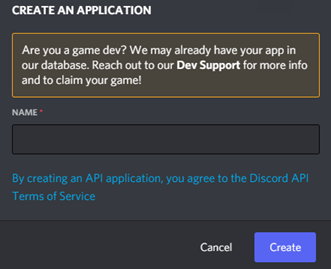
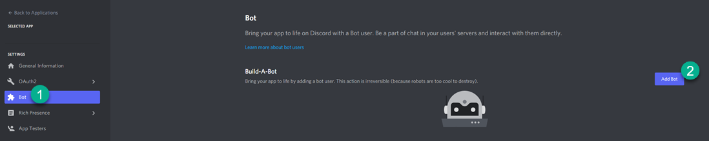
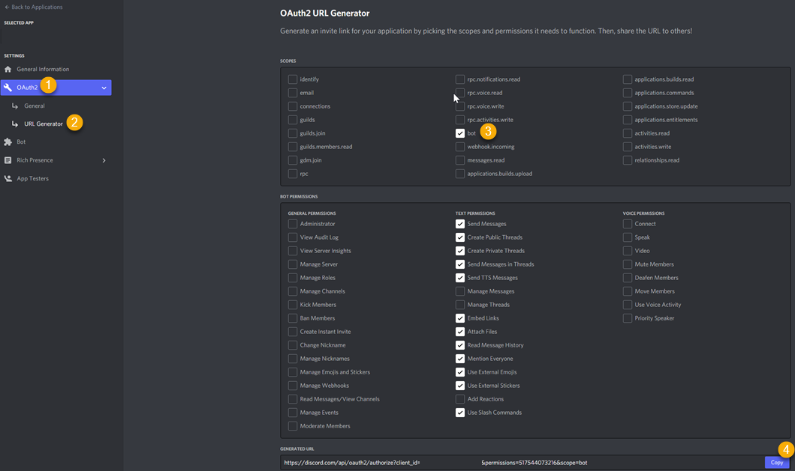

# Create a Discord Bot Account

There are two main steps to creating a Discord Bot.  The first is Creating the Bot itself while giving it all of the permissions it needs.  The second is adding it to your server.
Both are covered below.

## Creating the Bot

Before you can do anything with a discord bot, you first need a bot account.  This is done through the developer portal.

1. Sign in to the [Discord Developer Portal][ddp].
2. Note the first time you sign in, you might get taken to the Discord landing page.  Just click the [Developer Portal][ddp] link again and it'll take you to the right place.
3. In the Applications Menu, choose "New Application".  You'll see the New Application Dialogue:  
.
4. Give your application a name and click Create.  This is the name that will show up when your bot posts messages.  Some of my favorites are Firiona Scry, Holly Toonstalker, and GM Hopenot but you can always go generic and just say "MQDiscord" if you want as well.  I won't judge.
5. You'll land on the General Information page where you can now upload an App Icon.  Do that and click save.
6. Click on the "Bot" tab (1 in the picture below) and you'll see the "Build-A-Bot" screen:  

7. Click on "Add Bot" (2 in the picture above)
8. Click on "Copy" to Copy your bot token.  This token allows anyone who has it to use your bot, accessing all information that your bot has access to.  It is VERY IMPORTANT to keep this completely private.  When we talk about your "Token" this is what we are talking about.  Guard it like your account depends on it.  If it is ever compromised, you can click "Regenerate" to get a new token and render the old one invalid.  For example of what a token looks like mine is...no, wait, nevermind.  You almost had me.
9. Click on the "OAuth2" tab (1 in the pciture below) and then click on "URL Generator" (2 in the picture below):  

10. This is where we're going to grant our bot specific permissions.  The full permission list is [here][perms] if you want to know what each one of them does.  For now we're going to click on "bot" (3 in the picture above) and grant the following permissions:
    -  Send Messages
    -  Create Public Threads
    -  Create Private Threads
    -  Send Messages in Threads
    -  Send TTS Messages (this allows for Text To Speech)
    -  Embed Links
    -  Attach Files
    -  Read Message History (this allows us to see incoming chat)
    -  Mention Everyone
    - Use External Emojis
    - Use External Stickers
    - Use Slash Commands
11.  Now we're going to click on "Copy" (4 in the picture above) which gives us the URL we can use to authorize the bot.  Paste that into your browser window and we're ready to add your bot to the server.

## Authorizing the Bot

This is a pretty linear set of steps now that you're a veteran of all the steps above.  The only thing you need is the URL you copied.  Paste that into your browser.

1.  You'll see a screen that says "Bot Name Connect to Discord" and it will tell you who you're signed in as.  In order to add the bot to a server, you have to be able to Manage the server, so make sure it's a server you own and not like, your non MQ guild server.
2.  Select a server from the dropdown list and click Continue.
3.  Discord is going to show you all of the permissions we requested in the penultimate step above.  Since you've already reviewed them you can click Authorize.
4.  Discord might ask you if you're human.  If you are not human, get a human to complete the CAPTCHA for you.  If you have to go through more than two screens, you might also want to find a human to help you because you just found out you're not human.  I'm sorry.
5.  Your bot is now authorized and if you go look in your discord, you'll see it as Offline in the user list.  If you've made it this far, you're ready to start using MQDiscord.
6.  The only other thing to keep in mind is if you have private channels, you'll need to invite your bot to join those private channels before the bot can be used in them.

[ddp]:(https://discord.com/developers/applications)
[perms]:(https://discord.com/developers/docs/topics/oauth2)

